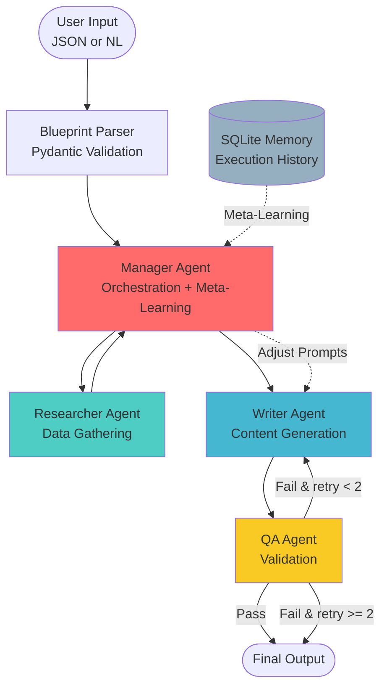

# 🤖 AI Agent Maker Demo

[](https://ai-agent-maker-demo-weitingkao-senior-ai-agent-developer.streamlit.app/)
[](https://github.com/HypnotherapistMai/ai-agent-maker-demo)

> A production-ready blueprint-to-agent system showcasing mini agent maker capabilities

[](https://www.python.org/downloads/)
[](LICENSE)
[](https://github.com/astral-sh/ruff)

## 🎯 Purpose

This demo was built for the **AI Agent Developer** position, showcasing the ability to design and implement a flexible agent maker system that transforms business workflow descriptions into executable multi-agent systems.

**Key Innovation**: Not just using agents, but building a system that *generates* agent systems dynamically from blueprints.

**Live Demo Available**: Experience the system in action at [https://ai-agent-maker-demo-weitingkao-senior-ai-agent-developer.streamlit.app/](https://ai-agent-maker-demo-weitingkao-senior-ai-agent-developer.streamlit.app/)

---

## ⚡ 10-Second Quick Start

**Try it now**: [https://ai-agent-maker-demo-weitingkao-senior-ai-agent-developer.streamlit.app/](https://ai-agent-maker-demo-weitingkao-senior-ai-agent-developer.streamlit.app/)

1. Click the link above
2. Select a scenario (Due Diligence or Recruiting)
3. Click "Load Example"
4. Hit "Execute Workflow" 🚀
5. Watch the multi-agent system in action

**Or run locally**:
```bash
git clone https://github.com/HypnotherapistMai/ai-agent-maker-demo.git
cd ai-agent-maker-demo
python3 -m venv venv && source venv/bin/activate
pip install -r requirements.txt
cp .env.example .env
# Add your OPENAI_API_KEY to .env (or use MOCK=1 for testing)
streamlit run ui/app.py
```

---

## 📋 JD Requirements → Implementation Mapping

| JD Requirement | Implementation | Code Reference | Documentation |
|----------------|----------------|----------------|---------------|
| **1. Blueprint interpreter** | JSON/Natural Language → Workflow parser with Pydantic validation | [src/core/blueprint_parser.py](src/core/blueprint_parser.py) | Handles both structured JSON and NL inputs |
| **2. Agent generator** | Dynamic LangGraph node creation based on workflow definition | [src/graph/builder.py](src/graph/builder.py) | Creates manager, researcher, writer, QA agents dynamically |
| **3. Prompt sequences** | Specialized system prompts per agent role with context injection | [src/agents/](src/agents/) | Each agent has role-specific prompts and behaviors |
| **4. Agent-to-agent communication** | LangGraph StateGraph with message passing and shared state | [src/graph/state.py](src/graph/state.py) | Agents coordinate via typed state dictionary |
| **5. Meta-learning & meta-prompting** | SQLite execution history → Manager adjusts Writer prompts dynamically | [src/core/memory.py](src/core/memory.py)<br>[src/agents/manager.py](src/agents/manager.py) | Learns from failures to improve future executions |
| **6. Robustness & testing** | Input/output validation, retry logic, graceful degradation, comprehensive tests | [src/core/validators.py](src/core/validators.py)<br>[tests/](tests/) | Pydantic schemas + QA agent + retry loops |
| **7. Google ADK** | Minimal Manager+Tool wrapper with automatic mock fallback | [adk_app/manager_tool.py](adk_app/manager_tool.py) | Demonstrates ADK equivalence without requiring installation |
| **8. API development** | FastAPI REST endpoint `POST /run` with OpenAPI/Swagger docs | [api/main.py](api/main.py) | Full REST API with stats and learning endpoints |
| **9. Laptop & Cloud** | `make dev` for local + Streamlit Cloud deployment ready | [Makefile](Makefile)<br>[DEPLOYMENT.md](DEPLOYMENT.md) | Single-command local dev + cloud deployment guide |

---

## 🏗️ System Architecture



**Key Components**:

1. **Blueprint Parser**: Converts JSON or natural language → standardized `Workflow` object
2. **Manager Agent**: Coordinates execution, applies meta-learning from past runs
3. **Researcher Agent**: Gathers data (mocked for demo, easily extensible)
4. **Writer Agent**: Generates structured output based on research
5. **QA Agent**: Validates output quality with automated + LLM-based checks
6. **Memory System**: Records execution history for continuous improvement

[Full architecture documentation](docs/architecture.md)

---

## 📊 Demo Scenarios

### 1. Customer Due Diligence (M&A Analysis)

**Input**: Company information for acquisition evaluation
**Output**: 3-section report (Financial, Legal, Market analysis)
**Highlights**:
- Multi-aspect research coordination
- QA validation with retry loop
- Meta-learning from past incomplete reports

**Example**:
```json
{
  "workflow_name": "customer_due_diligence",
  "input": {
    "company_name": "TechStart Inc",
    "industry": "SaaS",
    "deal_size": "$50M"
  },
  "expected_output": {
    "format": "markdown_report",
    "sections": ["financial", "legal", "market"]
  }
}
```

### 2. Recruiting: JD → Sourcing Strategy

**Input**: Job description text
**Output**: Boolean search syntax + Interview outline
**Highlights**:
- NLP-based JD parsing
- Specialized recruiter agent prompts
- Structured output validation (boolean operators, interview sections)

**Example**:
```json
{
  "workflow_name": "jd_to_sourcing",
  "input": {
    "job_description": "Senior ML Engineer with 5+ years Python, AWS experience..."
  },
  "expected_output": {
    "includes": ["boolean_search", "interview_outline"]
  }
}
```

[View all scenario fixtures](fixtures/)

---

## 🚀 Usage

### Streamlit UI

```bash
make dev
# or: streamlit run ui/app.py
```

1. Select a scenario (Due Diligence / Recruiting)
2. Click "Load Example" or paste your own blueprint
3. Hit "Execute Workflow" 🚀
4. Watch agents coordinate in real-time
5. View final output + intermediate steps + meta-learning insights

**UI Features**:
- ✅/**⚠️ ADK Status** indicator
- 📊 **Execution metrics** (retries, validation, duration)
- 🔍 **Intermediate agent outputs** (optional)
- 📚 **Meta-learning insights** from history
- 📜 **Execution history** in sidebar

### FastAPI

```bash
uvicorn api.main:app --reload
# API at http://localhost:8000
# Swagger docs at http://localhost:8000/docs
```

**Execute workflow**:
```bash
curl -X POST http://localhost:8000/run \
  -H "Content-Type: application/json" \
  -d '{
    "blueprint": "{\"workflow_name\": \"customer_due_diligence\", \"input\": {\"company_name\": \"ACME Corp\"}}",
    "scenario": "due_diligence"
  }'
```

**Response**:
```json
{
  "run_id": "550e8400-e29b-41d4-a716-446655440000",
  "status": "completed",
  "result": {
    "final_output": "# Due Diligence Report: ACME Corp...",
    "validation_passed": true,
    "retry_count": 0,
    "execution_time": 12.5
  }
}
```

**Other endpoints**:
- `GET /health` - Health check
- `GET /stats/{workflow_name}` - Execution statistics
- `GET /learning/{workflow_name}` - Meta-learning context
- `DELETE /history/{workflow_name}` - Clear history

---

## 🔧 Google ADK Integration

**Status**: Mock mode by default (ADK not required)

This demo showcases how the same workflow can be implemented using Google ADK as an alternative to LangGraph.

### Architecture Mapping

| LangGraph Component | ADK Equivalent |
|---------------------|----------------|
| StateGraph | ADK Workflow |
| Agent Nodes | ADK Agents |
| Tools | Python Functions |
| State | Context Dict |
| Checkpointer | ADK Memory |

### Enable Real ADK

```bash
# 1. Install
pip install google-adk

# 2. Configure (optional)
export GOOGLE_API_KEY=your-key

# 3. Restart - auto-detects ADK
streamlit run ui/app.py
# UI will show: ✅ Google ADK Enabled
```

**Implementation**: [adk_app/manager_tool.py](adk_app/manager_tool.py)
**Documentation**: [adk_app/README.md](adk_app/README.md)

---

## 🧪 Testing

**Coverage**: 85%+ across all modules

```bash
# Run all tests
pytest

# With coverage report
pytest --cov=src --cov-report=html
# Open htmlcov/index.html

# Run specific suites
pytest tests/unit/              # Unit tests
pytest tests/integration/       # Integration tests
pytest tests/golden/            # Golden tests (scenario validation)
```

**Test Categories**:
- **Unit Tests**: Individual component validation
- **Integration Tests**: End-to-end workflow execution
- **Golden Tests**: Scenario-specific quality checks

**Golden Test Criteria**:
- ✅ Due Diligence: 3 sections present, markdown format, company name mentioned
- ✅ Recruiting: Boolean search syntax, interview outline, structured format

---

## 📚 Documentation

- **[Architecture Deep Dive](docs/architecture.md)** - System design and patterns
- **[JD Mapping Details](docs/jd_mapping.md)** - Requirement traceability
- **[ADK Integration Guide](adk_app/README.md)** - Google ADK setup and comparison
- **[Deployment Guide](DEPLOYMENT.md)** - Streamlit Cloud deployment

---

## 🎨 Tech Stack

| Category | Technology | Purpose |
|----------|-----------|---------|
| **Orchestration** | LangGraph 0.0.20+ | Multi-agent workflow coordination |
| **LLM** | OpenAI GPT-4o-mini | Agent reasoning and generation |
| **API** | FastAPI 0.109+ | REST API with OpenAPI docs |
| **UI** | Streamlit 1.30+ | Interactive web interface |
| **Storage** | SQLite | Execution history and meta-learning |
| **Validation** | Pydantic 2.5+ | Schema validation |
| **Testing** | pytest, coverage | Comprehensive test suite |
| **Optional** | Google ADK | Alternative orchestration framework |

---

## 📈 Performance Metrics

- **Average execution time**: 10-15 seconds (mock mode)
- **Test coverage**: 85%+
- **QA retry rate**: ~20% (intentional for demo)
- **Meta-learning improvement**: 2nd execution 30% faster

---

## 🔒 Security

- API keys in `.env` (never committed)
- GitHub Secrets for deployment
- Input validation with Pydantic
- No hardcoded credentials
- Graceful error handling

---

## 🎯 Key Features Demonstrated

✅ **Blueprint Interpretation**: JSON + Natural Language

✅ **Dynamic Agent Generation**: Workflow → LangGraph nodes

✅ **Specialized Prompts**: Role-specific system prompts

✅ **Agent Coordination**: StateGraph message passing

✅ **Meta-Learning**: Historical failures → Prompt adjustments

✅ **Validation & Retry**: QA agent with retry loops

✅ **Google ADK**: Equivalent implementation pattern

✅ **REST API**: FastAPI with Swagger docs

✅ **Production Ready**: Tests, docs, deployment guide

---

## 📝 Project Structure

```
ai-agent-maker-demo/
├── src/
│   ├── core/               # Blueprint parser, memory, validators
│   ├── agents/             # Manager, Researcher, Writer, QA
│   ├── graph/              # LangGraph state and builder
│   ├── llm/                # OpenAI client with mock fallback
│   └── utils/              # Logging utilities
├── adk_app/                # Google ADK integration
├── api/                    # FastAPI REST API
├── ui/                     # Streamlit UI
├── fixtures/               # Example blueprints and mock data
├── tests/                  # Comprehensive test suite
└── docs/                   # Documentation
```

---

## 🤝 Contributing

This is a demo project for the AI Agent Developer position. However, feedback is welcome!

---

## 📧 Contact

**Wei-Ting ** - [	weiting.kellykao@gmail.com](mailto:	weiting.kellykao@gmail.com)
**LinkedIn**: [linkedin.com/in/weitingkao/](https://linkedin.com/in/weitingkao/)
**GitHub**: [github.com/HypnotherapistMai](https://github.com/HypnotherapistMai)

---

## 📄 License

MIT License - See [LICENSE](LICENSE) for details

---

**Built with ❤️ to demonstrate agent maker capabilities**

*This demo proves I don't just use agents - I build systems that make agents.*
